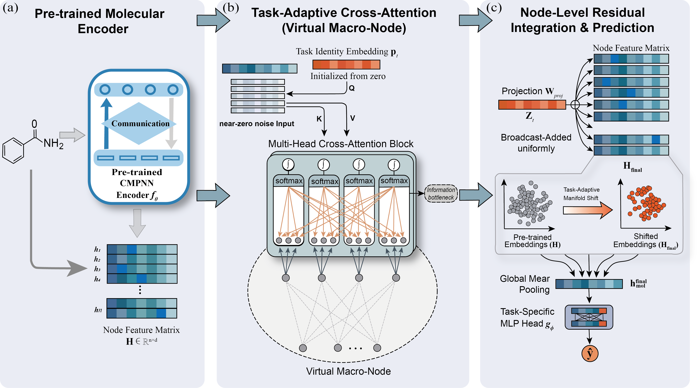

# TAPT: Task-Adaptive Prompt Tuning for Molecular Property Prediction


---

## Overview

**TAPT** (Task-Adaptive Prompt Tuning) is a minimalist, parameter-efficient fine-tuning
framework for molecular property prediction built on pre-trained Graph Neural Networks (GNNs).

Unlike prior knowledge-augmented approaches (e.g., KANO) that inject external chemical
knowledge graphs into prompts, **TAPT operates without any external ontology or chemical
knowledge base**. Instead, it relies solely on a lightweight, learnable **task identity
embedding** as the inductive bias for downstream adaptation.



### Core Mechanism

TAPT introduces a single **cross-attention bottleneck** that functions as a
*task-specific virtual macro-node*:

1. **Pre-trained Encoding** — A CMPNN encoder pre-trained on ZINC15 via self-supervised
   objectives produces node-level molecular representations `H ∈ ℝⁿˣᵈ`.
2. **Task-Adaptive Cross-Attention** — A learnable task identity embedding `pₜ` serves
   as the query against a near-zero noise input (`σ = 0.01`), producing a globally
   uniform task context vector `zₜ` that is independent of local molecular substructure.
3. **Residual Integration** — `zₜ` is broadcast as a uniform residual shift onto every
   node representation, geometrically shifting the entire molecular point cloud toward
   the target task manifold without altering pairwise inter-atomic distances.
---

## Environment Setup

**Option 1: Conda (recommended)**

```bash
conda env create -f environment.yaml
conda activate tapt
```

**Option 2: pip**

```bash
pip install -r requirements.txt
# or use the provided install script:
bash install.sh
```

> **Note:** Place the pre-trained graph encoder weights at:
> `./dumped/pretrained_graph_encoder/original_CMPN_0623_1350_14000th_epoch.pkl`

---

## Quick Start

### Pre-training

```bash
python pretrain.py
```

### Fine-tuning (example)

```bash
bash finetune.sh
```

---

## Benchmarks

### Classification Tasks

#### BBBP

```bash
python train.py \
    --use_tapt \
    --data_path ./data/bbbp.csv \
    --metric auc \
    --dataset_type classification \
    --epochs 100 \
    --num_runs 5 \
    --ensemble_size 5 \
    --gpu 0 \
    --batch_size 50 \
    --seed 4 \
    --init_lr 1e-4 --max_lr 1e-3 --final_lr 1e-4 \
    --warmup_epochs 2.0 \
    --split_type scaffold_balanced \
    --exp_name bbbp_tapt \
    --exp_id bbbp_tapt \
    --checkpoint_path ./dumped/pretrained_graph_encoder/original_CMPN_0623_1350_14000th_epoch.pkl \
    --prompt_dim 256 \
    --prompt_lr 1e-4 \
    --tapt_alpha 0.1
```

#### Tox21

```bash
python train.py \
    --use_tapt \
    --data_path ./data/tox21.csv \
    --metric auc \
    --dataset_type classification \
    --epochs 100 \
    --num_runs 3 \
    --ensemble_size 3 \
    --gpu 0 \
    --batch_size 50 \
    --seed 43 \
    --init_lr 1e-4 --max_lr 1e-3 --final_lr 1e-4 \
    --warmup_epochs 2.0 \
    --split_type scaffold_balanced \
    --exp_name tox21_tapt \
    --exp_id tox21_tapt \
    --checkpoint_path ./dumped/pretrained_graph_encoder/original_CMPN_0623_1350_14000th_epoch.pkl \
    --prompt_dim 256 \
    --prompt_lr 1e-4 \
    --tapt_alpha 0.1
```

#### SIDER

Use `--seed -1` to generate a random seed for each run.

```bash
python train.py \
    --use_tapt \
    --data_path ./data/sider.csv \
    --metric auc \
    --dataset_type classification \
    --epochs 100 \
    --num_runs 3 \
    --ensemble_size 3 \
    --gpu 0 \
    --batch_size 50 \
    --seed -1 \
    --init_lr 1e-4 --max_lr 1e-3 --final_lr 1e-4 \
    --warmup_epochs 2.0 \
    --split_type scaffold_balanced \
    --exp_name sider_tapt \
    --exp_id sider_tapt \
    --checkpoint_path ./dumped/pretrained_graph_encoder/original_CMPN_0623_1350_14000th_epoch.pkl \
    --prompt_dim 256 \
    --prompt_lr 1e-4 \
    --tapt_alpha 0.1
```

### Regression Tasks

#### QM7

```bash
python train.py \
    --use_tapt \
    --data_path ./data/qm7.csv \
    --metric mae \
    --dataset_type regression \
    --epochs 100 \
    --num_runs 3 \
    --ensemble_size 3 \
    --gpu 0 \
    --batch_size 256 \
    --seed 43 \
    --init_lr 1e-4 --max_lr 1e-3 --final_lr 1e-4 \
    --warmup_epochs 2.0 \
    --split_type scaffold_balanced \
    --split_sizes 0.8 0.1 0.1 \
    --exp_name tapt_qm7 \
    --exp_id scaffold \
    --checkpoint_path ./dumped/pretrained_graph_encoder/original_CMPN_0623_1350_14000th_epoch.pkl \
    --prompt_dim 128 \
    --num_prompt_tokens 10 \
    --prompt_lr 1e-3 \
    --kano_lr 1e-5 \
    --tapt_dropout 0.1 \
    --weight_decay 1e-5
```

#### QM8

```bash
python train.py \
    --use_tapt \
    --data_path ./data/qm8.csv \
    --metric mae \
    --dataset_type regression \
    --epochs 100 \
    --num_runs 3 \
    --ensemble_size 3 \
    --gpu 0 \
    --batch_size 256 \
    --seed 43 \
    --init_lr 1e-4 --max_lr 1e-3 --final_lr 1e-4 \
    --warmup_epochs 2.0 \
    --split_type scaffold_balanced \
    --split_sizes 0.8 0.1 0.1 \
    --exp_name tapt_qm8 \
    --exp_id tapt_qm8 \
    --checkpoint_path ./dumped/pretrained_graph_encoder/original_CMPN_0623_1350_14000th_epoch.pkl \
    --prompt_dim 128 \
    --num_prompt_tokens 10 \
    --prompt_lr 1e-3 \
    --kano_lr 1e-5 \
    --tapt_dropout 0.1 \
    --weight_decay 1e-5
```

---

## Key Arguments

| Argument | Description |
|---|---|
| `--use_tapt` | Enable the TAPT prompt tuning module |
| `--dataset_type` | `classification` or `regression` |
| `--metric` | `auc` (classification) / `mae` or `rmse` (regression) |
| `--seed` | Random seed; use `-1` for a random seed each run |
| `--prompt_dim` | Prompt embedding dimension |
| `--prompt_lr` | Learning rate for prompt parameters |
| `--tapt_alpha` | Weight of the TAPT auxiliary loss |
| `--num_prompt_tokens` | Number of learnable prompt tokens |
| `--tapt_dropout` | Dropout rate inside the TAPT module |
| `--kano_lr` | Learning rate for KANO encoder parameters |
| `--split_type` | Data split strategy (e.g., `scaffold_balanced`) |
| `--ensemble_size` | Number of models in the ensemble |
| `--num_runs` | Number of independent training runs |

---

## Project Structure

```
TAPT-main/
├── chemprop/           # Core model and training library
├── KGembedding/        # Knowledge graph embedding utilities
├── data/               # Benchmark datasets (CSV)
├── dumped/             # Checkpoints and pre-trained weights
├── logs/               # Training logs
├── train.py            # Main training entry point
├── predict.py          # Inference script
├── pretrain.py         # Pre-training script
├── finetune.sh         # Example fine-tuning command
├── install.sh          # Dependency installation script
├── environment.yaml    # Conda environment specification
└── requirements.txt    # pip requirements
```

---
