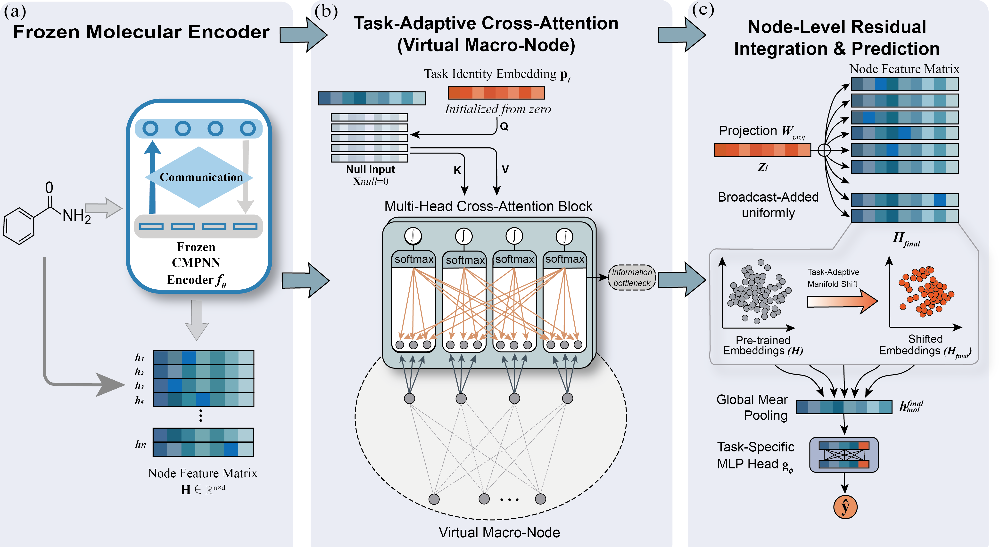

[](LICENSE)

# TAPT: Task-Aware Prompt Tuning for Molecular Property Prediction

This repository is the official implementation of **TAPT**, a task-aware prompt tuning framework built upon [KANO](https://www.nature.com/articles/s42256-023-00654-0) for molecular property prediction. TAPT introduces task-conditioned prompt generation via cross-attention between task embeddings and functional group features from the Chemical Element Knowledge Graph (ElementKG).

<div align="center">
  
</div>

---

## Brief Introduction

TAPT extends the KANO contrastive pre-training framework with a **task-aware prompt module** that dynamically generates molecular representations conditioned on the downstream task identity. It supports four operation modes ranging from the original KANO baseline to full synergy with task-aware prompts and knowledge graph features.

**Key contributions:**
- **Task Embedding Layer** — maps task IDs to learnable task vectors
- **Cross-Attention Module** — aligns task vectors with functional group atom features
- **TAPTPromptModule** — full 4-step prompt generation pipeline with molecular aggregation
- **Four operation modes** — flexible ablation and comparison between KANO and TAPT components

---

## Requirements

```
python          3.7
torch           1.13.1
rdkit           2018.09.3
numpy           1.20.3
gensim          4.2.0
nltk            3.4.5
owl2vec-star    0.2.1
Owlready2       0.37
torch-scatter   2.0.9
```

Install dependencies:

```bash
pip install -r requirements.txt
```

---

## Project Structure

```
TAPT-main/
├── chemprop/                        # Core library
│   ├── data/                        # Data loading and splitting
│   ├── features/                    # Molecular featurization
│   ├── models/
│   │   ├── model.py                 # Main model (KANO + TAPT integration)
│   │   ├── tapt_modules.py          # TAPT core modules
│   │   ├── model_tapt.py            # Alternative ultra-conservative TAPT
│   │   ├── cmpn.py                  # CMPN graph encoder
│   │   └── mpn.py                   # MPN graph encoder
│   ├── train/
│   │   ├── run_training.py          # Main training pipeline
│   │   └── train_tapt_full.py       # Full 4-module TAPT training
│   └── parsing.py                   # All argument definitions
├── data/                            # Molecular property datasets (15 tasks)
├── initial/                         # ElementKG embeddings
│   ├── ele2emb.pkl                  # Element embeddings
│   ├── fg2emb.pkl                   # Functional group embeddings
│   └── rel2emb.pkl                  # Relation embeddings
├── KGembedding/                     # ElementKG ontology and embedding tools
├── dumped/
│   └── pretrained_graph_encoder/    # Pre-trained CMPN checkpoint
├── fig/
│   └── overview.png                 # Architecture overview
├── train.py                         # Fine-tuning entry point
├── pretrain.py                      # Pre-training entry point
├── predict.py                       # Inference entry point
├── finetune.sh                      # Fine-tuning script
└── test.sh                          # Test script
```

---

## Operation Modes

TAPT supports four modes controlled by `--mode`:

| Mode | Alias | Components | Description |
|------|-------|------------|-------------|
| `mode1` | `pure_kano` | KANO only | Original KANO baseline |
| `mode2` | `task_only` | TAPT prompt (no KG) | Task-aware prompts without structural KG info |
| `mode3` | `kano_task` | KANO + TAPT | Hybrid: functional prompt + task-aware prompt |
| `mode4` | `kano_kg_task` | KANO + KG + TAPT | Full synergy with ElementKG features |

---

## Quick Start

### 1. Fine-tuning with pre-trained model

Run the provided fine-tuning script:

```bash
bash finetune.sh
```

Or run manually (example: ESOL regression):

```bash
python train.py \
    --use_tapt \
    --mode mode1 \
    --data_path ./data/esol.csv \
    --metric rmse \
    --dataset_type regression \
    --epochs 100 \
    --num_runs 3 \
    --gpu 0 \
    --batch_size 50 \
    --seed 4 \
    --init_lr 1e-4 \
    --split_type scaffold_balanced \
    --step functional_prompt \
    --exp_name finetune \
    --exp_id esol \
    --checkpoint_path "./dumped/pretrained_graph_encoder/original_CMPN_0623_1350_14000th_epoch.pkl" \
    --prompt_dim 256 \
    --prompt_lr 1e-4
```

### 2. Running TAPT mode (task-aware prompts)

```bash
python train.py \
    --use_tapt \
    --mode mode4 \
    --data_path ./data/bbbp.csv \
    --metric auc \
    --dataset_type classification \
    --epochs 100 \
    --num_runs 3 \
    --gpu 0 \
    --batch_size 256 \
    --seed 51 \
    --init_lr 1e-4 \
    --split_type scaffold_balanced \
    --step tapt \
    --exp_name tapt \
    --exp_id bbbp \
    --checkpoint_path "./dumped/pretrained_graph_encoder/original_CMPN_0623_1350_14000th_epoch.pkl" \
    --prompt_dim 128 \
    --task_id 0 \
    --freeze_kano
```

### 3. Making predictions

```bash
python predict.py \
    --exp_name pred \
    --exp_id pred \
    --checkpoint_path ./ckpt/model_0/model.pt \
    --test_path ./data/test.csv
```

The input CSV must contain a `smiles` column.

---

## Training Parameters

### General

| Parameter | Description | Default |
|-----------|-------------|---------|
| `--data_path` | Path to dataset CSV | — |
| `--dataset_type` | `classification` / `regression` / `multiclass` | `regression` |
| `--metric` | Evaluation metric (`auc`, `rmse`, `mae`, `r2`, ...) | auto |
| `--split_type` | `random` / `scaffold_balanced` / `cluster_balanced` | `random` |
| `--epochs` | Number of training epochs | `30` |
| `--num_runs` | Number of independent runs | `1` |
| `--batch_size` | Batch size | `50` |
| `--seed` | Random seed | `1` |
| `--gpu` | GPU index | CPU |
| `--checkpoint_path` | Path to pre-trained `.pkl` checkpoint | — |

### TAPT-specific

| Parameter | Description | Default |
|-----------|-------------|---------|
| `--use_tapt` | Enable TAPT mode | `False` |
| `--mode` | Operation mode (`mode1`–`mode4`) | `mode1` |
| `--step` | Training step (`functional_prompt` / `tapt`) | `functional_prompt` |
| `--prompt_dim` | Prompt vector dimension | `128` |
| `--num_prompt_tokens` | Learnable prompt tokens per task | `5` |
| `--task_id` | Task ID for multi-task settings | `0` |
| `--freeze_kano` | Freeze KANO encoder, train prompts only | `False` |
| `--prompt_lr` | Learning rate for prompt modules | `1e-3` |
| `--kano_lr` | Learning rate for KANO encoder | `1e-5` |
| `--tapt_alpha` | Prompt mixing weight | `0.001` |
| `--tapt_dropout` | Dropout for TAPT components | `0.1` |

---

## Datasets

| Dataset | Task | Type | Split |
|---------|------|------|-------|
| BACE | Binding (1) | Classification | Scaffold |
| BBBP | Blood-Brain Barrier (1) | Classification | Scaffold |
| ClinTox | Clinical Toxicity (2) | Classification | Scaffold |
| HIV | HIV Inhibition (1) | Classification | Scaffold |
| MUV | Virtual Screening (17) | Classification | Scaffold |
| SIDER | Side Effects (27) | Classification | Scaffold |
| Tox21 | Toxicity (12) | Classification | Scaffold |
| ToxCast | Toxicity (617) | Classification | Scaffold |
| ESOL | Aqueous Solubility (1) | Regression | Scaffold |
| FreeSolv | Hydration Free Energy (1) | Regression | Scaffold |
| Lipophilicity | Lipophilicity (1) | Regression | Scaffold |
| QM7 | Electronic Properties (1) | Regression | Scaffold |
| QM8 | Electronic Properties (12) | Regression | Scaffold |
| QM9 | Quantum Properties (12) | Regression | Scaffold |

---

## Pre-training

To pre-train the graph encoder from scratch on ZINC15 (250K molecules):

```bash
python pretrain.py --exp_name pretrain --exp_id 1 --step pretrain
```

A pre-trained checkpoint is provided at:

```
dumped/pretrained_graph_encoder/original_CMPN_0623_1350_14000th_epoch.pkl
```

---

## ElementKG Setup

ElementKG is stored in `KGembedding/elementkg.owl`. Pre-computed embeddings are provided in `initial/`. To regenerate:

```bash
# Step 1: Train ElementKG embeddings
cd KGembedding && python run.py

# Step 2: Build embedding dictionaries
cd ../initial && python get_dict.py
```

---

## Acknowledgements

This work builds upon:
- [KANO](https://github.com/ZJU-Fangyin/KANO) — Knowledge graph-enhanced molecular contrastive learning
- [chemprop](https://github.com/chemprop/chemprop) — Message passing neural networks for molecules
- [RDKit](https://github.com/rdkit/rdkit) — Cheminformatics toolkit
- [owl2vec-star](https://github.com/KRR-Oxford/OWL2Vec-Star) — OWL ontology embedding

---

## Citation

If you use this work, please cite the original KANO paper:

```bibtex
@article{fang2023knowledge,
  title={Knowledge graph-enhanced molecular contrastive learning with functional prompt},
  author={Fang, Yin and Zhang, Qiang and Zhang, Ningyu and Chen, Zhuo and Zhuang, Xiang and Shao, Xin and Fan, Xiaohui and Chen, Huajun},
  journal={Nature Machine Intelligence},
  pages={1--12},
  year={2023},
  publisher={Nature Publishing Group UK London}
}
```

---

## Contact

For questions, please open an issue or contact the repository maintainer.
